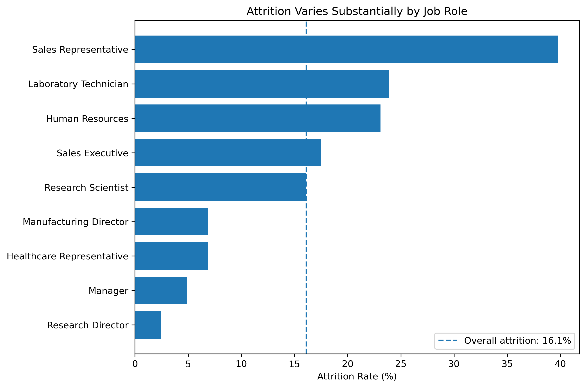
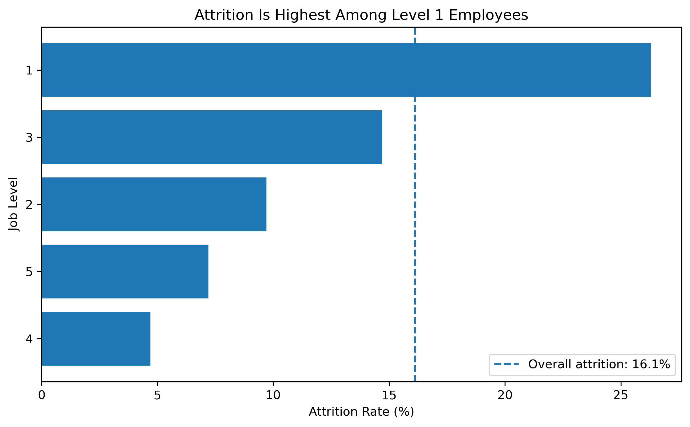
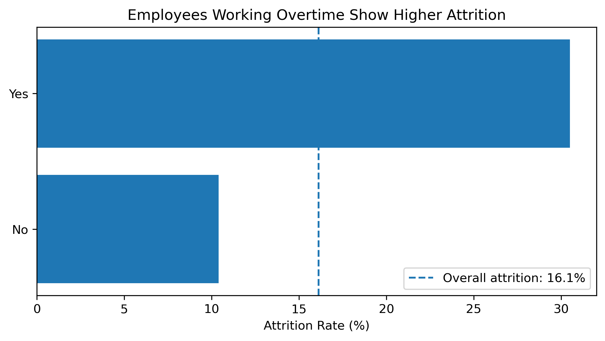
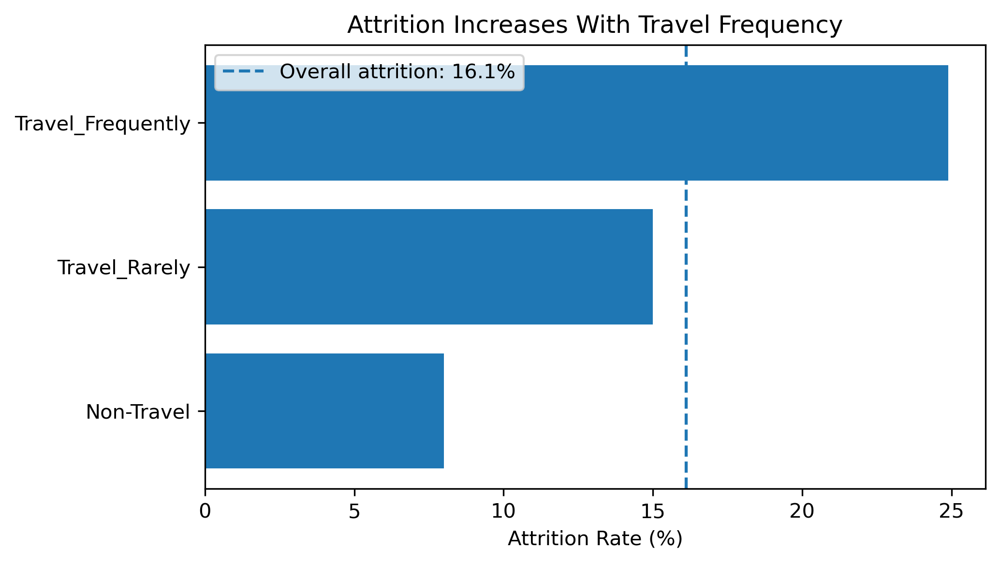
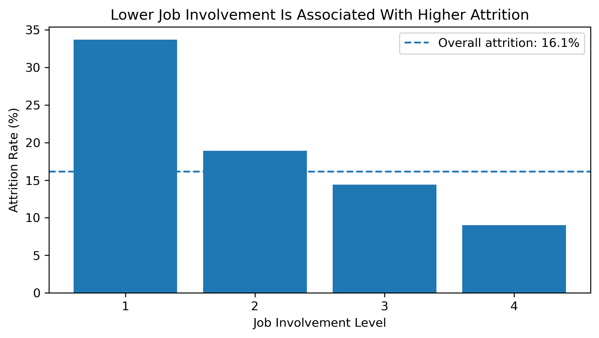
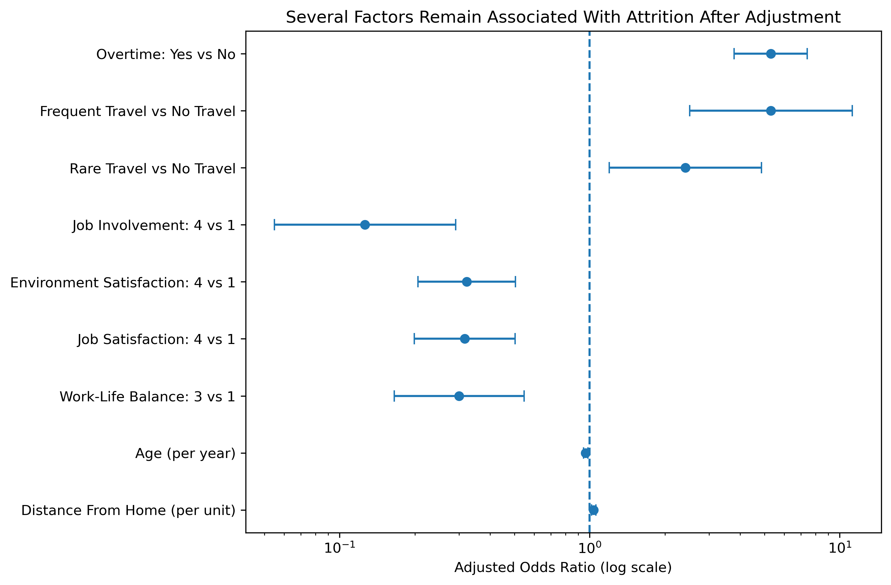

## Executive Summary

This case study analyzes a fictional workforce of 1,470 employees to explore where employee attrition is concentrated and which workforce characteristics are associated with higher turnover.

Overall attrition was **16.1%**, but the pattern was not evenly distributed across the organization. Attrition was particularly elevated among Sales Representatives, Level 1 employees, employees working overtime, frequent business travelers, and employees reporting lower levels of job involvement and workplace satisfaction.

Multivariate analysis showed that several of these relationships remained after accounting for other workforce characteristics, suggesting that workload, travel requirements, employee experience, career stage, and commute burden warrant deeper organizational investigation.

Rather than treating the results as causal, this case study uses the analysis to identify where HR leaders could focus further diagnosis and targeted intervention.

## Business Question

**Where is attrition concentrated in the workforce, what factors are associated with employee turnover, and where should HR leaders investigate or intervene first?**

### Analytical Questions

1. What is the overall level of attrition?
2. Which workforce segments experience disproportionately high attrition?
3. Which work, career, and employee-experience factors are associated with attrition?
4. Which relationships remain after accounting for other workforce characteristics?
5. What organizational questions and actions should leaders consider based on these patterns?

## Dataset

This case study uses the **IBM HR Analytics Employee Attrition & Performance dataset**, a fictional dataset created for analytical and educational purposes.

The dataset contains:

- **1,470 employee records**
- **35 original variables**
- Demographic, job, compensation, tenure, satisfaction, travel, and work-context measures
- A binary attrition outcome indicating whether an employee stayed or left

Because the dataset is fictional and cross-sectional, findings should be interpreted as analytical associations rather than evidence of causal relationships.

## Analytical Approach

The analysis followed five stages:

1. **Data quality and preparation**  
   Assessed missing values, constant fields, identifiers, and variable types.

2. **Workforce segmentation**  
   Compared attrition rates across departments, job roles, and job levels.

3. **Bivariate analysis**  
   Examined relationships between attrition and work context, employee experience, career characteristics, and demographic factors.

4. **Statistical analysis**  
   Used chi-square tests, effect sizes, and odds ratios to assess the strength of observed relationships.

5. **Multivariate analysis**  
   Used logistic regression to examine which associations remained after accounting for other workforce characteristics.

### Tools

Python · Pandas · SciPy · Statsmodels · Matplotlib · Jupyter · Tableau Public · Quarto

## Workforce Attrition Overview

The fictional workforce includes **1,470 employees**, of whom **237 left the organization**, resulting in an overall attrition rate of **16.1%**.

| Workforce | Attritions | Attrition Rate |
|---:|---:|---:|
| **1,470** | **237** | **16.1%** |

Attrition, however, was not evenly distributed across the organization. Several workforce segments experienced substantially higher turnover than the organizational average.

### Attrition by Job Role



The largest concentration appeared among **Sales Representatives**, where attrition reached **39.8%**, approximately **2.5 times the organizational average**. Laboratory Technicians and Human Resources roles also experienced above-average attrition.

This suggests that attrition is concentrated within particular workforce segments rather than reflecting a uniform organization-wide pattern.

### Attrition by Job Level



Attrition was also disproportionately concentrated among more junior employees. **Level 1 employees experienced a 26.3% attrition rate**, compared with the organizational average of 16.1%.

Higher job levels generally showed lower observed attrition, although the pattern was not perfectly linear across levels. This suggests that career stage warrants further investigation alongside role, workload, employee experience, and other workforce characteristics.

## What Is Associated With Attrition?

The next stage examined whether work demands and employee-experience measures were associated with higher observed attrition.

### Overtime



Employees working overtime experienced **30.5% attrition**, compared with **10.4%** among employees not working overtime.

The unadjusted odds of attrition were approximately **3.8 times higher** among employees working overtime.

### Business Travel



Frequent business travelers experienced **24.9% attrition**, compared with **15.0%** among employees who traveled rarely and **8.0%** among non-travelers.

This suggests that travel intensity may warrant further investigation alongside workload and role design.

### Job Involvement



Employees reporting the lowest level of job involvement experienced **33.7% attrition**, compared with **9.0%** among those reporting the highest level.

Similar patterns were also observed for environment satisfaction, job satisfaction, and work-life balance, suggesting that employee experience may be an important part of the attrition picture.

## Adjusted Analysis

Descriptive patterns can overlap. For example, younger employees may also be more junior, earn less, have shorter tenure, and work in different roles.

To examine which relationships remained after accounting for other workforce characteristics, a multivariate logistic regression model was estimated using work-context, career-stage, employee-experience, age, tenure, and commute variables.



### What Remained Important?

**Overtime remained one of the strongest signals.** Employees working overtime had approximately **5.3 times the adjusted odds of attrition** compared with employees not working overtime.

**Business travel also remained strongly associated with attrition.** Frequent travelers had approximately **5.3 times the adjusted odds** compared with employees who did not travel, while employees who traveled rarely had approximately **2.4 times the odds**.

**Employee experience continued to matter after adjustment.** Higher levels of job involvement, environment satisfaction, job satisfaction, and work-life balance were generally associated with lower attrition odds relative to the lowest rating levels.

**Age and commute distance retained smaller but persistent associations.** Each additional year of age was associated with approximately **3.6% lower odds of attrition**, while each additional unit of distance from home was associated with approximately **3.8% higher odds**.

### A More Nuanced Tenure Story

Employees who left had shorter company tenure on average: **5.1 years compared with 7.4 years** among employees who stayed.

However, after other workforce characteristics were taken into account, Years at Company was no longer clearly associated with attrition (`p = .059`).

This suggests that the initial tenure difference may partly reflect other characteristics such as career stage, work demands, employee experience, and age rather than tenure alone.

### Model Diagnostic

The adjusted model showed meaningful in-sample discrimination (**ROC-AUC = 0.82**) and a McFadden pseudo-R² of **0.237**.

These diagnostics indicate that the included workforce characteristics collectively distinguish leavers from stayers reasonably well within this fictional dataset. However, performance was measured on the same data used to estimate the model and should not be interpreted as validated predictive accuracy.

## Key Findings

The analysis suggests that attrition is concentrated within specific workforce segments and is associated with a combination of work demands, employee experience, career stage, and personal context.

### 1. Attrition is concentrated rather than organization-wide

Overall attrition was **16.1%**, but rates varied substantially across roles and job levels.

Sales Representatives experienced **39.8% attrition**, approximately 2.5 times the organizational average, while Level 1 employees experienced **26.3% attrition**.

This suggests that retention challenges may be more effectively addressed through targeted workforce diagnosis rather than broad organization-wide interventions.

### 2. Work demands are among the strongest signals

Employees working overtime experienced **30.5% attrition**, compared with **10.4%** among employees not working overtime.

After accounting for other workforce characteristics, overtime remained strongly associated with attrition, with approximately **5.3 times the adjusted odds** of leaving.

Frequent business travel showed a similarly strong adjusted association.

These results do not establish that overtime or travel causes attrition, but they suggest that workload, scheduling, staffing capacity, travel expectations, and role design warrant closer investigation.

### 3. Employee experience remains relevant after adjustment

Lower job involvement, environment satisfaction, job satisfaction, and work-life balance were associated with higher attrition.

Several of these relationships persisted after accounting for career stage, work context, age, tenure, and other factors.

This suggests that retention cannot be understood solely through compensation or demographic characteristics. The day-to-day employee experience may also play an important role.

### 4. Career-stage patterns are more complex than they first appear

Employees who left were generally younger, lower paid, less experienced, and shorter-tenured than employees who remained.

However, company tenure became much less important once other workforce characteristics were considered.

This suggests that apparent early-tenure attrition may partly reflect underlying differences in job level, workload, employee experience, career stage, or other organizational conditions.

### 5. Commute burden may be a secondary consideration

Employees who left lived farther from work on average, and distance from home remained associated with attrition after adjustment.

The effect was smaller than the associations observed for overtime, travel, and employee experience, but it suggests that location, flexibility, and commuting expectations may warrant consideration as part of a broader retention diagnosis.

## Business Implications

The findings point toward a targeted diagnostic approach rather than a single retention solution.

| Analytical Finding | Leadership Question | Potential Next Step |
|---|---|---|
| High Sales Representative and Level 1 attrition | What is different about the work and employee experience in these populations? | Conduct targeted employee listening, exit analysis, and manager interviews |
| Strong overtime association | Is overtime driven by understaffing, workload peaks, role design, scheduling, or manager practices? | Examine overtime concentration by role, team, manager, and business cycle |
| High attrition among frequent travelers | Are travel requirements sustainable, predictable, and within employee control? | Review travel expectations and segment patterns by role and tenure |
| Lower involvement and satisfaction | Which workplace conditions distinguish higher- and lower-scoring employee groups? | Combine survey data with qualitative listening and manager-level analysis |
| Junior and early-career concentration | Are career expectations, development opportunities, and mobility paths clear? | Review onboarding, career pathways, internal mobility, and manager support |
| Distance from home | Does commute burden interact with flexibility or scheduling expectations? | Examine location, work arrangement, and schedule flexibility patterns |

## Recommended Next Steps

If this were a live organizational diagnosis, the analysis would be used to guide the next phase of investigation rather than to prescribe immediate solutions.

Recommended next steps would include:

1. **Prioritize high-attrition populations**  
   Begin with Sales Representatives, Level 1 employees, and other segments materially above the organizational baseline.

2. **Investigate workload and role design**  
   Determine whether overtime and travel reflect staffing gaps, demand volatility, role expectations, scheduling practices, or other operating-model issues.

3. **Add employee voice**  
   Combine quantitative workforce data with engagement comments, pulse surveys, stay interviews, exit feedback, and manager interviews to understand the experience behind the patterns.

4. **Examine manager and team variation**  
   Analyze whether attrition and employee-experience patterns are concentrated within particular teams or reporting structures.

5. **Assess career and mobility experience**  
   Explore whether junior employees have clear development pathways, sufficient manager support, and realistic opportunities for internal movement.

6. **Test interventions rather than assume causality**  
   Where practical, pilot targeted changes and measure whether workforce outcomes improve before scaling interventions more broadly.

## Interactive Tableau Dashboard

Explore the workforce patterns interactively using the dashboard below. Use the Department filter or select a job role to examine how attrition patterns change across workforce segments.

```{=html}
<div style="width:100%; overflow-x:auto; text-align:center;">
<iframe
  src="https://public.tableau.com/views/EmployeeAttritionWorkforceRiskAnalysis/Dashboard1?:showVizHome=no&:embed=yes"
  width="1200"
  height="900"
  frameborder="0"
  style="border:0; max-width:100%;">
</iframe>
</div> 

## Analytical Limitations

This case study uses a **fictional, cross-sectional workforce dataset** and is intended to demonstrate an analytical approach rather than make claims about an actual organization.

The analysis identifies **associations rather than causal relationships**. Important factors such as manager quality, labor-market conditions, organizational change, employee comments, team climate, external opportunities, and longitudinal workforce history are not available in the dataset.

The logistic regression model was evaluated on the same data used to estimate it. Its ROC-AUC therefore represents **in-sample discrimination** and should not be interpreted as validated predictive performance.

The findings should be viewed as signals that would guide further organizational diagnosis, not as evidence that any single factor directly causes attrition.

## Technical Details

This case study was developed using Python and Jupyter for data preparation, exploratory analysis, statistical testing, and logistic regression; Tableau Public for interactive visualization; and Quarto for publishing.

### Methods

- Data quality and variable assessment
- Workforce segmentation and attrition-rate analysis
- Chi-square tests for categorical relationships
- Cohen's *d* for numeric group differences
- Unadjusted odds ratios
- Multivariate logistic regression
- Model diagnostics using McFadden pseudo-R² and ROC-AUC

### Source Code

The full analysis notebook and project files are available in the GitHub repository.

[View the analysis notebook on GitHub](https://github.com/elainepatrao/elainepatrao.github.io/blob/main/projects/employee-attrition/notebooks/attrition-analysis.ipynb)

[View this project on GitHub](https://github.com/elainepatrao/elainepatrao.github.io/tree/main/projects/employee-attrition)